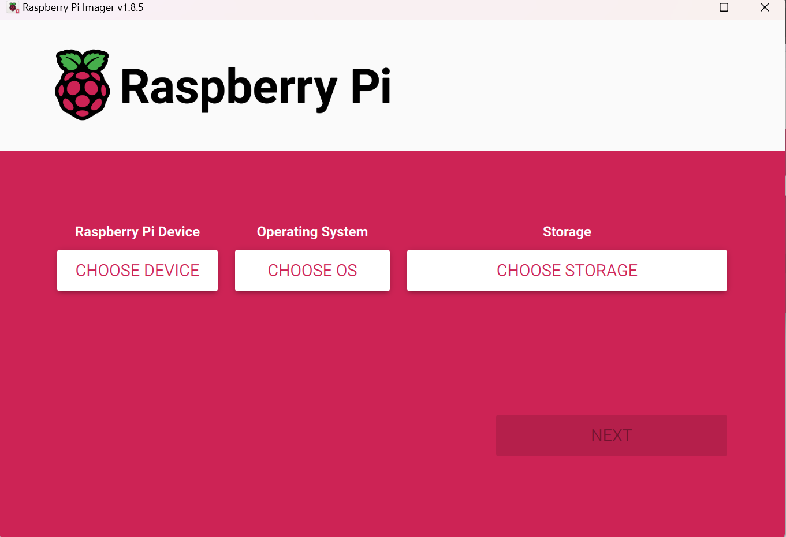

## OBS: du må ha raspberry pi imager installert før du kan fortsette.

## RESTARTE RASPBERRY PI SD-KORT

### 1. ta ut SD-kort fra raspberry pi

### 2. sett SD-kortet inn i SD-kort terminalen på siden av din egen PC

### 3. start raspberry pi imager

### 4. velg informasjonen som tilsvarer det din raspberry PI inneholder

### 5. trykk next og vent til at SD-kortet er ferdig med å overskrive.

### 6. etter at du har overskrevet SD-kortet ditt, så kan du ta den ut fra PC-en og sette den tilbake inn i raspberry PI-en din.

## SETT OPP RASPBERRY PI-BRUKER PÅ UBUNTU

### 1. velg hvilket språk du prefererer å bruke

### 2. velg keyboard layout du prefererer å bruke

### 3. velg landet/byen du befinner deg i (f.eks. Oslo)

### 4. skriv inn navnet ditt, hva du vil pc-en din skal hete, et brukernavn som du må kunne huske godt og et passord som du ikke kan glemme.

### 5. nå er det bare å vente til at ubuntu maskinen er ferdig med å laste ned.

### 6.  når den er ferdig med å laste ned, så kan du gå til neste steg.

### 7. du vil få opp denne screen, bare skip alt til du har kommet deg til main screen.

## LASTE NED SSH PÅ UBUNTU (raspberry pi)

### 1. Åpne terminalen med CTRL + ALT + T (her skriver du kommandoene under)

### 2. Se etter og installer oppdateringer til all programvare som er installert

### 3. skriv "sudo apt update" (finner oppdateringer)

### 4. skriv "sudo apt upgrade" (installerer oppdateringer)

## OPPSETT AV BRANNMUR MED UFW (Uncomplicated FireWall)

### 1. sudo apt install ufw (installerer UFW)

### 2. sudo ufw enable (aktiverer brannmuren ved oppstart)

### 3. sudo ufw allow ssh (tillater SSH-tilkoblinger gjennom brannmuren)

### 4. Senere kan du sjekke statusen på brannmuren ved å skrive sudo ufw status

## laste ned og Skru på ssh

### 1. sudo apt install openssh-server (installerer SSH-serveren)

### 2. sudo systemctl enable ssh (gjør sånn at SSH skrur seg på ved oppstart)

### 3. sudo systemctl start ssh (starter SSH her og nå)

## Finn IPen din – den trenger du når du skal bruke SSH

### 1. skriv "ip a"

### 2. Hvis du har kablet nettverk, vil IP vises ved eth0: linje. Hvis du kun har trådløst, vil ip-adresse  vises ved wlan0: linje. IP-adresse er vanligvis 10.2.3.x eller noe lignende (hvor x er et nummer mellom 2 og 254)

## INSTALLERE Git, Python og MariaDB

### 1. sudo apt install python3-pip

### 2. sudo apt install git

### 3. sudo apt install mariadb-serverd. sudo mysql_secure_installation

## LAGE NY DATABASE-BRUKER OG SETTE INN RIKTIGE RETTIGHETER

### 1. Logg inn i MariaDB ved å skrive "sudo mariadb –u root"

### 2. Lag ny bruker ved å skrive "CREATE USER 'username'@'localhost' IDENTIFIED BY 'password';"

### 3. Gi den nye brukeren rettigheter ved å skrive "GRANT ALL PRIVILEGES ON *.* TO 'username'@’localhost’IDENTIFIED BY 'password';"

### 4. Oppdater rettigheter ved å skrive "FLUSH PRIVILEGES;"